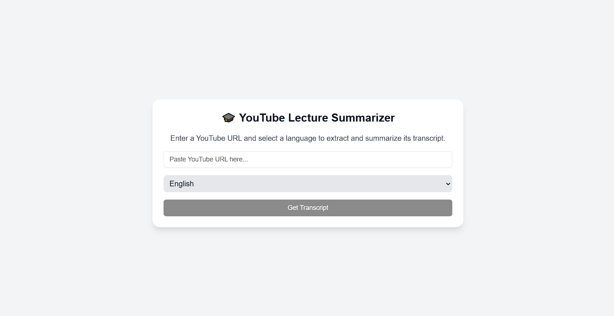
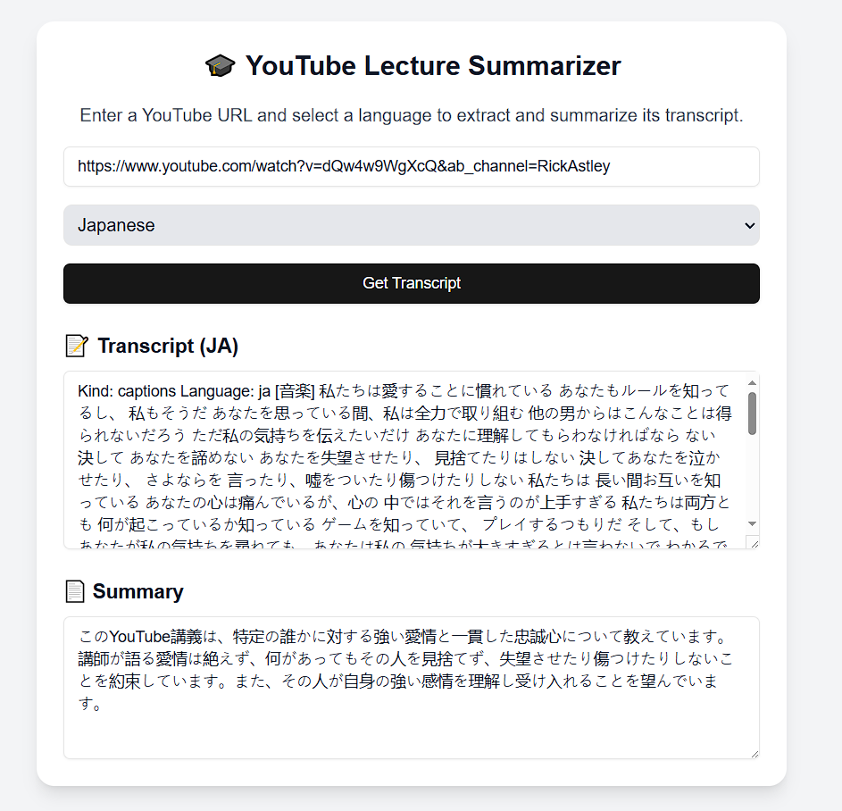

AI Youtube Lecture Summarizer

This project is an **AI-powered YouTube Lecture Summarizer** that extracts **transcripts** from YouTube videos and generates **concise summaries** using **OpenAI GPT-4**. 





## Features
• Extracts transcripts** from YouTube videos  
• Summarizes lectures using GPT-4**  
• Supports multiple languages (configurable)** 
• Beautiful, responsive UI (Next.js + Tailwind)**  

## Tech Stack
• Frontend: Next.js, React, Tailwind CSS, ShadCN UI  
• Backend API: Next.js API Routes, OpenAI GPT-4  
• Transcripts: External YouTube Transcript API  

## Installation & Setup
### Clone the Repository
```bash
git clone https://github.com/Yun8caiii/AI-Youtube-Lecture-Summarizer.git
cd AI-Youtube-Lecture-Summarizer

Install Dependencies

    npm install

Set Up Environment Variables in your .env 

    OPENAI_API_KEY=your-openai-api-key

Run the Development Server

    npm run dev
```

## How To Use
1) Enter a Youtube video URL 
2) Click "Get Transcript"
3) View the full transcript & AI-genrated summary

This project is open-source under the MIT License.
Feel free to fork, modify, and contribute! 😊

Connect With Me
📧 Email: yun8caiii@gmail.com
🌎 Portfolio: yuncai.dev
